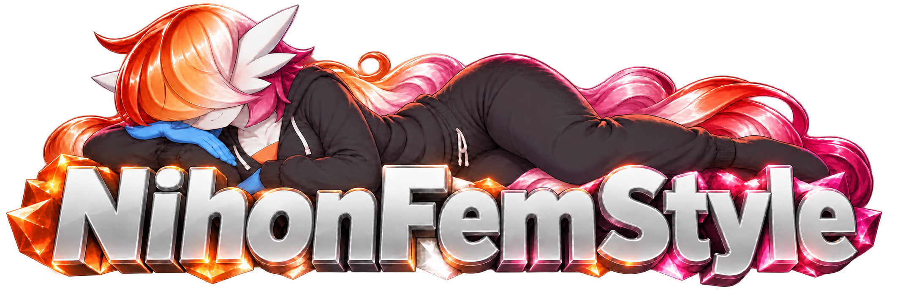
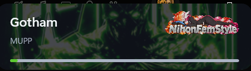
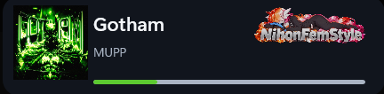
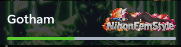

<p align="center"></p>

<h1 align="center">Nihon's Music Framework</h1>

<p align="center">A native, open-source Windows music overlay and reusable DirectX integration library written in modern C++.</p>

<p align="center">
  <a href="https://github.com/NihonFemStyle/music-framework/actions/workflows/build.yml"></a>
  <a href="https://github.com/NihonFemStyle/music-framework/actions/workflows/cutting-edge.yml"></a>
  <a href="https://github.com/NihonFemStyle/music-framework/releases"></a>
  
  
  
  
</p>

Nihon's Music Framework reads the active Windows media session, renders a native always-on-top overlay, and remains click-through until interaction mode is toggled. It has no third-party GUI framework and is designed both as a standalone application and as a foundation for in-process DirectX integrations.

## Highlights

- Windows media discovery through Global System Media Transport Controls and C++/WinRT
- Title, artist, album, playback state, timeline, and album artwork
- Smooth, extrapolated progress between Windows media updates
- Always-on-top, click-through Win32 overlay
- Configurable double-tap shortcut for entering and leaving interaction mode
- Draggable overlay while interactive
- Compact layout, 10–100% opacity, native color picker, and dynamic artwork-derived accent
- Artwork tile or rounded, aspect-correct background mode
- DWM backdrop blur where supported
- Native Direct2D, DirectWrite, and WIC rendering
- Tray icon for settings, interaction control, and clean exit
- Persistent settings under `%LOCALAPPDATA%\NihonsMusicFramework\settings.ini`
- Embedded banner, application icon, and Release runtime dependencies
- Renderer abstraction for Direct3D 9, 10, 11, and 12 integration
- Explicitly constrained experimental no-CRT build path

## Preview

<table>
  <tr>
    <td align="center"><strong>Normal — artwork background</strong><br></td>
    <td align="center"><strong>Normal — artwork tile</strong><br></td>
  </tr>
  <tr>
    <td align="center"><strong>Compact — artwork background</strong><br></td>
    <td align="center"><strong>Compact — artwork tile</strong><br></td>
  </tr>
</table>

## Requirements

- Windows 10 or Windows 11
- Visual Studio 2022 with **Desktop development with C++**
- Windows 10/11 SDK
- CMake 3.24 or newer
- A media application that publishes a Windows system media session

## Quick start

Clone the repository:

```powershell
git clone https://github.com/NihonFemStyle/music-framework.git
cd music-framework
```

From PowerShell in the repository root:

```powershell
.\build.ps1
```

Run:

```powershell
.\build-x64-default\Release\musicoverlay_app.exe
```

The first launch asks for a renderer preference. The current standalone host renders through Direct3D 11; the saved preference is groundwork for additional standalone hosts and does not yet switch the active standalone API.

## Using the overlay

The overlay starts in click-through mode. Double-tap the configured shortcut within one second to enter or leave interaction mode. The default shortcut is **Shift**.

While interactive:

- Drag unused space to reposition the overlay.
- Select the gear icon to open settings.
- Choose opacity, compact layout, a custom accent, dynamic accent, or artwork-background mode.
- Select the shortcut row, press any valid keyboard combination, then release it to save.
- Use the renderer row to save a preferred API for a future restart.

The settings panel animates open and closed. Leaving interaction mode closes it automatically.

The tray icon provides **Open settings**, **Enable/disable interaction**, and **Exit**. Double-clicking it opens settings.

> On April 1, artwork-background mode intentionally stretches the artwork. This is a feature of questionable artistic merit.

## Build options

```powershell
.\build.ps1 -Configuration Debug
.\build.ps1 -Configuration RelWithDebInfo
.\build.ps1 -Architecture ARM64
.\build.ps1 -Clean
.\build.ps1 -NoCRT
```

Release builds use the static MSVC runtime and embed the application artwork. See [Building](docs/BUILDING.md) for direct CMake commands, install targets, and troubleshooting.

### Cutting-edge artifacts

Every push to `main`, nightly schedule, or manual dispatch builds downloadable cutting-edge artifacts for x64, Win32, and ARM64 across Debug, Release, RelWithDebInfo, and MinSizeRel. The same matrix is built for the experimental no-CRT mode. These artifacts are retained for 14 days and identify their exact commit and configuration in `build-info.txt`; they are development snapshots, not stable releases.

## Renderer support

| Backend | Integration object | Included UI rendering | Standalone host | Notes |
|---|---:|---:|---:|---|
| Direct3D 9 | Yes | Limited native backbuffer text | No | Requires a compatible backbuffer `GetDC` path. |
| Direct3D 10 | Yes | Direct2D/DirectWrite | No | Host supplies device and swap chain. |
| Direct3D 11 | Yes | Direct2D/DirectWrite/WIC | **Yes** | Full standalone experience. |
| Direct3D 12 | Binding validation | Host-rendered | No | Host owns command recording, resource states, and synchronization. |

The abstraction intentionally does not inject unsafe D3D12 commands into an unknown host command list. See [Integration](docs/INTEGRATION.md).

## Repository layout

```text
include/MusicOverlay/       Public integration headers
src/Core/                   Thread-safe media state
src/Platform/Windows/       GSMTC and Windows platform code
src/Renderer/               D3D9–D3D12 renderer implementations
src/UI/                     Direct2D/DirectWrite/WIC overlay painter
src/Standalone/             Win32 application, resources, and manifest
src/NoCRT/                  Experimental minimal no-CRT entry point
assets/                     Embedded banner and application icon sources
docs/                       Design, build, integration, and no-CRT guides
```

## Documentation

- [Building and packaging](docs/BUILDING.md)
- [Architecture](docs/ARCHITECTURE.md)
- [Integration guide](docs/INTEGRATION.md)
- [No-CRT scope and limitations](docs/NOCRT.md)
- [Changelog](CHANGELOG.md)
- [Contributing](CONTRIBUTING.md)
- [Security policy](SECURITY.md)

## Known limitations

- The standalone application currently creates a Direct3D 11 device regardless of the saved renderer preference.
- D3D9 UI support is intentionally limited.
- D3D12 requires a host-specific command-list and synchronization contract.
- Media availability and metadata quality depend on the source application's GSMTC implementation.
- The no-CRT executable is a minimal experiment and does not include the full overlay feature set.

## License

Nihon's Music Framework is available under the [MIT License](LICENSE). You may use, copy, modify, merge, publish, distribute, sublicense, and sell copies subject to the license notice and warranty disclaimer.

